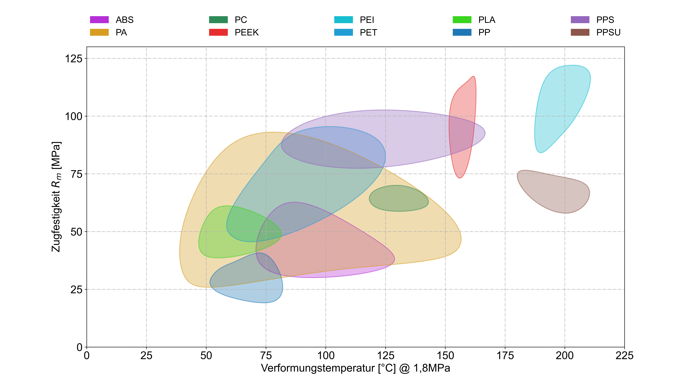

<p align="center">
  
</p>

<h1 align="center">PolyPlot</h1>

<p align="center">Build Ashby plots from your material data, right in the browser, with a live preview.</p>

<p align="center"><strong>Use it online, nothing to install: <a href="https://ashby.aerospace-lab.de">ashby.aerospace-lab.de</a></strong></p>

PolyPlot turns a spreadsheet of material properties into Ashby plots: every material family gets a colored hull around its data points, so you can see at a glance which materials cover which region of, say, strength against heat deflection temperature. You pick the data source and the two quantities, and PolyPlot draws the plot. Everything else (colors, fonts, reference lines, annotations, export format) can be tuned but has sensible defaults.




## What it can do

### Data sources

- **Excel upload** – pick an `.xlsx` workbook and a sheet. The file is read in the browser and
  sent with each render request; the server never stores it. A copy is cached in the browser so
  the workbook is still available after a reload.
- **Provided datasets** – workbooks placed on the server (in `backend/material_properties`) show
  up as a dropdown. A workbook or folder whose name starts with `#` (e.g. `#Partners.xlsx`) is
  only listed and read for holders of the attribution key (`ASHBY_ATTRIBUTION_KEY`).
- **Teable** – paste the link to a [Teable](https://teable.io) table and an API key to plot
  straight from the database.

### Datasets and plots

- A project holds several **datasets**, and each dataset holds several **plots**. Settings that
  should match across plots (data source, axis definitions, material colors, fonts, image output)
  are set once per dataset; title, axes, hulls and extras are set per plot.
- Add, duplicate, rename, reorder and move plots between datasets. Tick the plots you want and
  **Generate all** downloads them as one `.zip`.

### Plot settings

- **Axis definitions** – name a quantity and pick the column(s) it comes from. Plots choose their
  X and Y from these quantities, optionally divided by another quantity per point (e.g. strength
  per density), on a linear or logarithmic scale. The display area is found automatically with an
  adjustable margin, or set by hand.
- **Hulls** – group the points by a column (e.g. polymer family) and draw one hull per group.
  Filter groups with a whitelist or blacklist of keywords, stack several layers, and choose the
  hull algorithm (smooth *cubic* or *alpha* shapes) and opacity.
- **Materials and legend** – each material keeps the same color in every plot of a dataset.
  Generate evenly spaced colors, add entries for all materials in use, or pick colors with a
  color picker (including a screen eyedropper where the browser supports it).
- **Extras** – colored areas (axis ranges or polygons), guidelines (straight lines through a point
  with a given slope, e.g. lines of constant ratio) and annotations with text, marker and arrow.
- **Text and look** – font style, family and sizes, aspect ratio, LaTeX in labels, a copyright line and an optional watermark. Titles and labels can be kept in
  several languages, and each plot is rendered in the language you choose.
- **Image output** – SVG or PNG (with a chosen resolution), transparent, white or dark background.

### Working with the editor

- **Live preview** that refreshes after each change (or on demand), can be enlarged, shows the
  render status and passes on warnings from the plotting code.
- **Simple / All settings** – Simple mode hides everything that is fine at its default. Markers
  show which settings are required, worth checking or safe to leave, and which you changed. A
  counter lists missing required settings, and **Find a setting** jumps to any field.
- **Config as JSON** – import and export the whole project as one `.json` file, or edit it in the
  built-in JSON editor. Examples are in [`examples/`](examples/); every field is explained in
  [`backend/docs/config_explanation.jsonc`](backend/docs/config_explanation.jsonc).
- **Several browser tabs** – tabs of the same workspace stay in sync; middle-click a plot to open
  it in a new tab.
- **Log** of renders, imports and downloads, with tracebacks and backend output when something
  goes wrong.
- UI in **English and German**, with light, dark or system theme.
- **No external requests** – the app loads no web fonts, CDN scripts or trackers.

## Credits

- A basic version of the backend was written by [walgren](https://github.com/walgren/Ashby-plots)
- Major rework by [afffe18](https://github.com/afffe18)
- UI by [afffe18](https://github.com/afffe18) & [13Bytes](https://github.com/13Bytes); most of the
  frontend code was written with Codex and Claude.

Improved as part of [RePolySat](https://aerospace-lab.de/repolysat/) @ [Aerospace-Lab](https://aerospace-lab.de/).

---

## Development

PolyPlot has two parts:

- **Frontend** – React + TypeScript + Tailwind, built with Vite (`src/`).
- **Backend** – FastAPI + matplotlib (`backend/`). It renders the plots and reads the data
  sources. Plotting code lives in `backend/plot.py` and `backend/plotting/*`.

### Frontend

```bash
npm install
npm run dev
```

### Backend (FastAPI)

The backend is a web server and must be started with Uvicorn (running `backend/app.py` directly
will exit immediately after import). Start it in a second terminal:

```powershell
python -m venv backend\.venv
backend\.venv\Scripts\python -m pip install -r backend\requirements.txt
backend\.venv\Scripts\python -m uvicorn backend.app:app --reload --host 0.0.0.0 --port 8000
```

You can also use the npm shortcut once the backend environment is active:

```powershell
npm run backend
```

### URLs

- Frontend dev server: `http://127.0.0.1:5173`
- Backend API: `http://127.0.0.1:8000`
- The Vite dev server proxies `/api/*` requests to the backend.

### API

| Endpoint | Purpose |
| --- | --- |
| `POST /api/render-plot` | Renders one plot from the full JSON config. Returns the image; non-fatal plot messages come back in the `X-Ashby-Messages` header. |
| `GET /api/render-status/{request_id}` | Progress of a running render. |
| `POST /api/download-plots` | Renders several plots and returns them as a `.zip`. |
| `POST /api/import-database` | Reads columns, keywords and sheet names from an uploaded workbook, a provided dataset or a Teable table, without storing anything. With the attribution key it also returns the first 500 rows for the data preview. |
| `GET /api/import-database/datasets` | Lists the workbooks in `backend/material_properties`; those starting with `#` only with the attribution key. |
| `GET /api/health` | Health check. |

### Validation

```powershell
npm run build
npm run lint
```

### Tests

The repository includes two lightweight automated test suites:

- Frontend tests (`tests/frontend/*.test.mjs`, Node's built-in test runner). `utils.test.mjs` and `editing.test.mjs` import the TypeScript modules directly and test their behavior (config import/export round trips, tab sync, translations, moving and duplicating plots, required settings, color math, reading Excel files, …); `proxy.test.mjs` checks the component wiring to the backend and that the app loads nothing from other servers. `register-ts.mjs` registers a small loader that transpiles `.ts` files for these tests. The frontend tests do not need the backend.
- Backend API integration tests that hit the running FastAPI server over HTTP.

The backend tests need a running backend (see above). They use `http://127.0.0.1:8000` unless
`ASHBY_BACKEND_URL` says otherwise.

```powershell
npm test                # all tests
npm run test:frontend   # frontend only
npm run test:backend    # backend only
```

What the tests cover:

- Backend render endpoint returns an image for a known sample config.
- Backend render endpoint exposes plotting warnings via response metadata when the config references missing-but-fallback axis columns.
- Backend spreadsheet upload returns detected columns and the original display `import_file_name`.
- Request-scoped spreadsheet bytes can be attached to render and download endpoints successfully.
- Frontend `PlotPage` still posts to `/api/render-plot` with the active dataframe/frame selection.
- Frontend preview still turns the backend response blob into an ``.
- Frontend preview still reads and displays plot messages returned by the backend.
- App state still keeps uploaded Excel files in browser memory and passes request-scoped datasource files into `PlotPage`.
- Config export → import round trips keep every setting (also for the files in `examples/`).
- Tab sync only exchanges configs between tabs of the same workspace; a duplicated tab without sessionStorage gets the config from the other tabs.
- Moving plots between datasets and duplicating them keep names, UI keys and "include" states consistent.
- Excel files are read into memory and fall back to the copy in browser storage when the original can no longer be read.
- The app loads no web fonts, CDN scripts or trackers.
- Every UI language defines every translation key.

GitHub Actions runs the build and all tests on every push and pull request
([`.github/workflows/run-tests.yml`](.github/workflows/run-tests.yml)).


## Deployment

In production the backend also serves the built frontend, so PolyPlot runs as **one process on
one port** (8000 by default).

### Docker

The [`Dockerfile`](Dockerfile) builds the frontend and copies it into a Python image with the
backend:

```bash
docker build -t polyplot .
docker run --rm -d --name polyplot -p 8000:8000 -v "$(pwd)/material_properties:/app/backend/material_properties" polyplot
```

Then open `http://127.0.0.1:8000`. Workbooks in the mounted `material_properties` folder appear as
provided datasets.

When the tests pass on `main` or `deployment`, GitHub Actions builds the image and publishes it to
the GitHub Container Registry as `ghcr.io/13bytes/ashby`, tagged with the branch name
([`.github/workflows/release-gui.yml`](.github/workflows/release-gui.yml)):

```bash
docker run --rm -d -p 8000:8000 -v "$(pwd)/material_properties:/app/backend/material_properties" ghcr.io/13bytes/ashby:main
```

### Without Docker

```bash
python build.py
```

`build.py` runs `npm run build` and copies `dist/` into `backend/production-frontend/`. Then start
the backend without `--reload`:

```bash
python -m uvicorn backend.app:app --host 0.0.0.0 --port 8000
```

### Configuration

| Variable | Default | Purpose |
| --- | --- | --- |
| `PORT` | `8000` | Port of the Docker container's server. |
| `ASHBY_MATERIAL_PROPERTIES_DIR` | `backend/material_properties` | Folder with the provided Excel datasets. |
| `ASHBY_ATTRIBUTION_KEY` | unset | Key that unlocks the copyright and watermark switches in the editor (settings dialog). Without it, rendered plots carry "created using ashby.aerospace-lab.de" and the standard watermark. It also opens the provided datasets whose name starts with `#` and the data preview. Unset: nobody can unlock them. Use a long random value, e.g. `openssl rand -base64 24`. |
