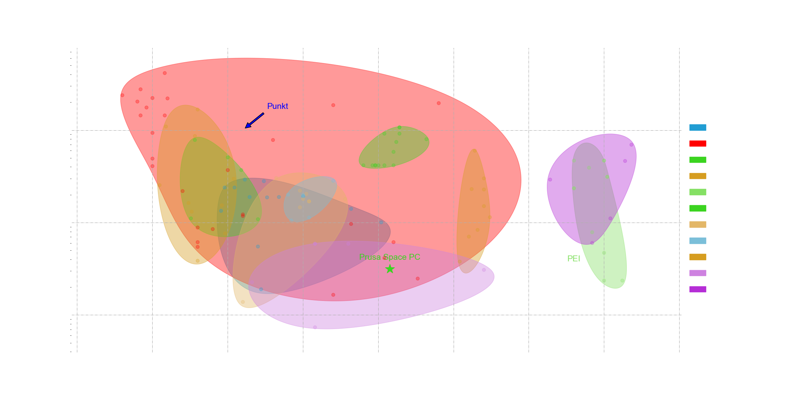
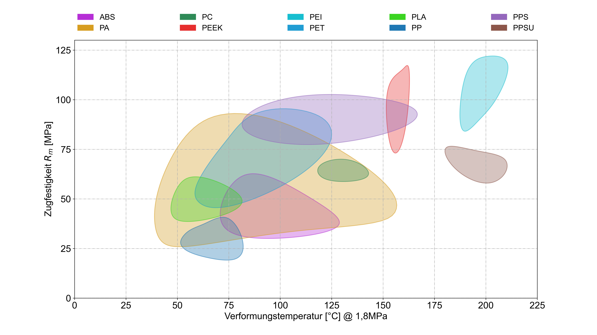

# Ashby plots in python
 Python script to generate Ashby plots based on own material database. This Program allows you to:
 * import via Teable API or Excel
 * creation of custom guidelines to show proportional correlation,
 * color areas to highlight relevant spots
 * put annotations with optional arrows and markers everywhere
 * $\LaTeX$ support for every label (e.g. $\frac{\sqrt E}{\rho}$)
 * easy language switch
 * filter your data for relevant points
 * export the plot transparent with white font or inset a water mark
 * automatic display area
 * log and semilog
 * generation of multiple plots at once
 * multi Layer support to peek into subgroups of hulls
 * color & transparency definitions
 * export as .png or .svg with variable aspect ratio and resolution 
 * live manipulation in popup plot
 * and much more ...
 
all the setting can be adjusted in the config.json file an created by execution the plot_ashby.py

 Here's a sample Ashby plot generated by the package:

 
 

Der source-code stammt ursprüngilich von diesem [GitHub](https://github.com/walgren/Ashby-plots) (MIT-Lizens).
Um den Code ganz auf unsere Bedürfnisse anpassen zu können, haben wir ihn auf unser GitLab übernommen.

## Verwendung
1. VSC vorbereiten: 
   1. Python extension installieren
   2. virtual environment installieren (requirements.txt)
   3. Python interpreter wählen: 
   Strg+Shift+P → Python:Select Interpreter → Enter Path → Find → .\Ashby\Scrips\python.exe
3. Excel-Tabelle in .\material_properties\ ablegen
4. Einstellungen in **config.json** anpassen ([siehe Erklärung](docs\config_explanation.jsonc))
5. plot_ashby.py ausführen
